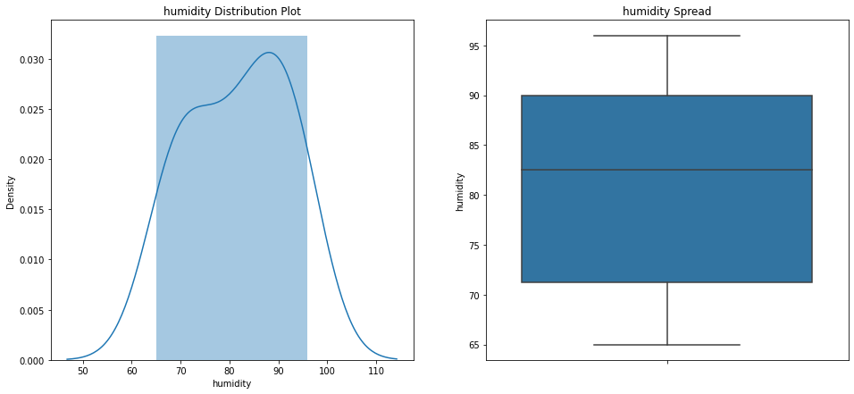

# Dataset Explore Tool - DET


Bu projede Python dili kullanılarak makine öğrenmesindeki veri seti analizi ve veri ön işleme konusunun bir kısmı otomatize edilmeye çalışıldı. Biliyorsunuz ki makine öğrenmesi modeli geliştirmenin önemli bir kısmını veri analizi ve veri ön işleme adımları oluşturuyor. Projenin amacı da makine öğrenmesi modeli geliştiren kişiler için kolay bir şekilde veri setini tanımalarını ve çıkarım yapmalarını sağlamaktır. Veri setindeki kolonların hangi kategoride bulunduğu, kaç adet none değer olduğu ve hangi kolonda olduğu, aykırı (outlier) değerin sayısı, veri setine ait genel istatistiksel bilgiler, one-hot encoding ile encode edilmesi kolonların tespit edilmesi ve otomatik olarak encode edilmesi, label encoding ile encode edilmesi gereken kolonların tespit edilmesi ve encode işleminin gerçekleştirilmesi, bağımlı öznitelik hakkında grafiksel çıkarımlar gibi bir çok özellik bulunmaktadır. Bu scriptte eksik özelliklerde bulunmaktadır. İleri ki zamanlarda geliştirilmeye devam edilecektir.


## Giriş


Scripti projece dahil etmek için ilk olarak script.py isimli dosyayı projenizin root dizinine koymalısınız. Daha sonra aşağıdaki koddaki gibi kütüphaneyi projenize dahil edebilirsiniz.

````python
from dp_script import Preprocessing
````


Bu adımdan sonra bu sınıftan bir nesne oluşturmalısınız. Kurucu sınıf parametre olarak bir veri seti ve bağımlı değişkenin ismini beklemektedir. Bu parametreleri kurucu metoda verdikten sonra artık sınıfa ait diğer metotlara erişebilirsiniz. Örnek olması açısından churn analizinde kullanılan bir veri seti kullanılmıştır.

````python
df = pd.read_csv('churn_dataset.csv')
det = Preprocessing(df,'Churn')
````


> Veri seti hakkında genel bilgi edinmek

Veri setine ait özniteliklerin tipleri hakkında detaylı bilgiler, kaç adet none verilerin bulunduğu ve hangi öznitelikteki adedi, özniteliklere ait değer dağılımları, nümerik özniteliklere ait istatistiksel veriler ve aykırı (outlier) değer tespiti bilgilerini ekrana yazan genel bilgilendirici bir metottur.

````
det.explore_dataset()
````

Not : Aşağıda farklı bir verinin çıktıları ter almaktadır.

````python
Veri setinde 14 satır veri bulunmakta.
Veri setinde 5 adet öznitelik bulunmakta.

    outlook  temperature  humidity  windy play
0     sunny           85        85  False   no
1     sunny           80        90   True   no
2  overcast           83        86  False  yes


Veri setinde 3 adet kategorik öznitelik bulunmaktadır.
--------------------------------
1  -->  outlook
2  -->  windy
3  -->  play

UYARI! >>> outlook özniteliğinin sahip olduğu eşsiz değer sayısı : 3
Bu özniteliği one hot encoding ile dönüştürebilirsiniz.
--------------------------------

Veri setinde 2 adet nümerik (sayısal) öznitelik bulunmaktadır.
--------------------------------
1  -->  temperature
2  -->  humidity

Veri setinde 0 adet nümerik fakat kategorik olarak belirtilmiş öznitelik var.
--------------------------------


Veri setinde bulunan kolonların isimleri : 
--------------------------------
1  -->  outlook
2  -->  temperature
3  -->  humidity
4  -->  windy
5  -->  play
--------------------------------
Veri setinize ait boş (None) değerlerin dağılımı
--------------------------------
outlook        0
temperature    0
humidity       0
windy          0
play           0
dtype: int64
--------------------------------
Toplam boş değerlerin sayısı : 0


Kategorik özniteliklerin değer dağılımları : 
--------------------------------
rainy       5
sunny       5
overcast    4
Name: outlook, dtype: int64
--------------------------------
False    8
True     6
Name: windy, dtype: int64
--------------------------------
yes    9
no     5
Name: play, dtype: int64
--------------------------------


temperature özniteliği için aykırı değerlerin sayısı : 0
humidity özniteliği için aykırı değerlerin sayısı : 0


Numerik verilere ait istatistiksel veriler : 


             count       mean        std   min    25%   50%    75%   max
temperature   14.0  73.571429   6.571667  64.0  69.25  72.0  78.75  85.0
humidity      14.0  81.642857  10.285218  65.0  71.25  82.5  90.00  96.0
````


> Bağımlı değişken hakkında grafiksel çıkarımlar

Sınıfın kurucu metodunda vermiş olduğunuz bağımlı değişken ismine göre script, bir distribution plot (dağılım grafiği) ve bir box plot (kutu grafiği) çizer. Kişiler buradan bağımlı öznitelikte aykırı değerlerin olup olmadığını ve normal dağılıma ne kadar benzediği gibi çıkarımları inceleyebilmektedir. Metodun kullanımı aşağıdaki gibidir.

````python
det.dependent_explore()
````


NOT : Bağımlı özniteliğinizin değerlerinin kategorik veri olmaması gerekir. Aksi takdirde metot size hata mesajı ile yanıt verecektir. Bunun için eğer bağımlı özniteliğiniz kategorik veriden oluşuyorsa lütfen encoding işlemi yaptıktan sonra bu metodu çağırın.

[](depend_plot.png)


> Seçilen öznitelik hakkında istatistiksel bilgiler

Bu metot ile seçtiğiniz bir öznitelik hakkında bazı istatistiksel verilere ulaşırsınız. Bunlar; özniteliğe ait kırılım dağılımları, her bir eşsiz değere ait oran bilgisi ve bağımlı öznitelik kırılımında medya bilgileri yer almaktadır. Metodun kullanımı aşağıdaki gibidir.

````
det.explain_column('outlook')
````


NOT : Bağımlı özniteliğinizin değerlerinin kategorik veri olmaması gerekir. Aksi takdirde metot size hata mesajı ile yanıt verecektir. Bunun için eğer bağımlı özniteliğiniz kategorik veriden oluşuyorsa lütfen encoding işlemi yaptıktan sonra bu metodu çağırın.

````python
	Kolon : outlook

          ADET      ORAN  MEDYAN 
rainy        5  0.357143     83.4
sunny        5  0.357143     82.0
overcast     4  0.285714     79.0
````


> Veri setindeki özniteliklerin getirilmesi

Bu metot vermiş olduğunuz veri setindeki öznitelikleri kategorik, nümerik ve nümerik fakat kategorik olarak ayırarak size geri döndürür. Liste formatında dönen öznitelik isimlerini veri setinizde kullanabilirsiniz. Metodun kullanımı aşağıdaki gibidir.

````python
det.get_columns()
````


> Kategorik özniteliklere dönüşüm uygulamak (One-hot Encoding)

drop_first = Bu parametre ile elde ettiğiniz kolonlardan ilkinin düşürülmesini sağlayabilirsiniz. Bunun amacı dummy varaibleslardan (kukla değişkenler) kurtulmaktır. 

Bu metot veri setinizde bulunan kategorik verilerden, değer sayısı ikiden fazla olan değişkenler için one hot encoding yöntemini uygulayarak size encode edilmiş bir DataFrame nesnesi döndürür. Ön tanımlı olarak  drop_first parametresi ' FALSE ' olarak gelmektedir. Metodun kullanımı aşağıdaki gibidir.

````python
get_one_hot_encoding(drop_first = False)
````


> Kategorik özniteliklere dönüşüm uygulamak (Label Encoding)

Bu metot veri setinizde bulunan kategorik verilerden, değer sayısı ikiye eşit olan değişkenler için label encoding yöntemini uygulayarak size encode edilmiş bir DataFrame nesnesi döndürür. Metodun kullanımı aşağıdaki gibidir.

````python
det.get_label_encoding()
````


>İstenilen DataFrame'lerin birleştirilmesi

**kwargs = anahtar argüman olarak birleştirmek istediğiniz DataFrame'leri alır. first=df şeklinde ilk parametreyi verebilirsiniz. Bu metot parametre olarak verdiğiniz tüm DataFrame nesnelerini birleştirir ve geriye bir DataFrame nesnesi döndürür. Metodun kullanımı aşağıdaki gibidir.

````python
det.concatenate_columns(first=cat,second=num)
````


>Verilerin normalize edilmesi


target_column : Normalizasyon işleminin uygulanacağı özniteliğin ismini temsil eder. Pandas Series tipinde girdi alır. Bu metot seçmiş olduğunuz öznitelikteki verileri ölçekleyerek normal dağılıma dönüştüren bir yapıdır. Bu sayede daha performanslı modeller elde edilebilir. Geriye bir array nesnesi döner. Bu değerleri DataFrame'e eklemek için aşağıdaki örnek koda benzer bir kod yazabilirsiniz.

 ==> dataFrame['temperature'] = normalize_data(dataFrame['temperature']).reshape(len,1)

Metodun kullanımı aşağıdaki gibidir.

````
det.normalize_data(df['temperature'])
````


## Gereksinimler

````
Python 3.x.x
------------
Pandas kütüphanesi
NumPy kütüphanesi
Matplotlib kütüphanesi
Seaborn kütüphanesi
Sklearn kütüphanesi
````


## Notlar

* Yukarıda da belirtildiği gibi bazı metotları kullanmadan önce bağımlı özniteliğinizi dönüştürmeniz gerekir. Bunun için sklearn kütüphanesinde bulunan Label Encoder'ı kullanabilirsiniz.
* Kütüphane üzerinde istediğiniz değişiklikleri yapabilir, geliştirebilirsiniz.


## Yazarlar

Emirhan KIRAN - [Emirhan KIRAN](https://www.linkedin.com/in/emir-kiran/)